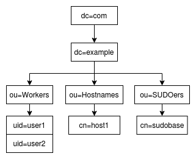

# BLK Domain Controller

##### Server
- BLK (Bind9/LDAP/Kerberos)

##### Client
- [x] GNU/Linux (SSSD)
- [x] Mac OS
- [ ] Windows

## Usage

### Test with Vagrant

Install all:
```
make vagrant-deploy
```

Destroy all:
```
make vagrant-destroy
```

### Install in production

Install all:
```
make install
```

Uninstall all:
```
make uninstall
```

## Manage users

### Script blksmanager

Script in node Kerberos

```
Usage BLKS Manager
Options:

  -m <MODE> (add_user, delete_user)
  -l [HOST LDAP]
  -a <ADMIN LDAP>
  -w <ADMIN LDAP PASSWORD>
  -x [HOSTNAME]
  -u [USERNAME]
  -p [USERNAME PASSWD]
  -g <GID>
  -d <DOMAIN>
  -e [PWEXPIRE]
  -k [KEYTAB FILE]

Example add User:
blksmanager -m add_user -l [HOST LDAP] -a (ADMIN_LDAP) -w (ADMIN_PASS_LDAP) -u (USER) -p (USER_PASSWD) -g (USER_GID_LDAP) -d (DOMAIN) -e [PWEXPIRE] -k [KEYTAB FILE]

Example delete User:
blksmanager -m delete_user -l [HOST LDAP] -a (ADMIN_LDAP) -w (ADMIN_PASS_LDAP) -u (USER) -d (DOMAIN) -k [KEYTAB FILE]

Example add Host:
blksmanager -m add_host -l [HOST LDAP] -a (ADMIN_LDAP) -w (ADMIN_PASS_LDAP) -x (HOSTNAME) -d (DOMAIN)

Example delete Host:
blksmanager -m delete_host -l [HOST LDAP] -a (ADMIN_LDAP) -w (ADMIN_PASS_LDAP) -x (HOSTNAME) -d (DOMAIN)

Example add user to Host:
blksmanager -m add_user_to_host -l [HOST LDAP] -a (ADMIN_LDAP) -w (ADMIN_PASS_LDAP) -x (HOSTNAME) -u (USER) -d (DOMAIN)

Example delete user to Host:
blksmanager -m delete_user_to_host -l [HOST LDAP] -a (ADMIN_LDAP) -w (ADMIN_PASS_LDAP) -x (HOSTNAME) -u (USER) -d (DOMAIN)
```

**Add user simple:**

```
blksmanager -m add_user -a admin -w admin_pass -u user1 -p user1 -g 5000 -d example.com 
```

**Add user with password [expire time](https://web.mit.edu/kerberos/krb5-1.12/doc/basic/date_format.html#getdate):**

```
blksmanager -m add_user -a admin -w admin_pass -u user1 -p User1234567890@ -g 5000 -e "300 sec" -d example.com 
```

**Add Host**

Control of which users can logging in to which computers: `inventory/local/group_vars/all/sssd.yml`
- enable: `access_provider: ldap`
- disable: `access_provider: krb5`
```
blksmanager -m add_host -a admin -w admin_pass -x usuario-desk -d example.com
```

**Add User to host**
```
blksmanager -m add_user_to_host -a admin -w admin_pass -x usuario-desk -u user1 -d example.com
```

**Delete user:**

```
blksmanager -m delete -a admin -w admin_pass -u user1 -d example.com
```

### Manual

**Add User:**

```
ldapadd -D "cn=admin, dc=example,dc=com" -w admin_pass << EOF
dn: uid=user,ou=People,dc=example,dc=com
objectClass: top
objectClass: posixAccount
objectClass: inetOrgPerson
objectClass: person
uid: user
sn: user
givenName: user
cn: user
displayName: user
uidNumber: 1005
gidNumber: 5000
gecos: user
loginShell: /bin/bash
homeDirectory: /home/user
EOF
```
```
kadmin.local -q "add_principal user@EXAMPLE.COM"
kinit user@EXAMPLE.COM
```

Option 1:
```
kadmin.local -q "ktadd -norandkey user@EXAMPLE.COM"
```

Option 2:
```
kadmin.local -q "xst -norandkey user@EXAMPLE.COM"
```

**Test User:**

```
kinit -kt /etc/krb5.keytab user
getent passwd user
id user
login user
```

**Delete User:**

```
ldapdelete -x -D "cn=admin,dc=example,dc=com" 'uid=user,ou=People,dc=example,dc=com' -w admin_pass
kadmin.local -q "delete_principal user@EXAMPLE.COM"
kdestroy
rm -f /etc/krb5.keytab 
```

## ERRORS

### Links of interest

- https://docs.oracle.com/cd/E19253-01/816-4557/index.html
- https://docs.oracle.com/cd/E19253-01/816-4557/trouble-6/index.html


##### ERROR: Decrypt integrity check failed

**Option 1:** Possible incorrect password.
Did you export the principal with norandkey? By default ktadd exports changes the key to a random one.
Can you loging with kinit user@EXAMPLE.COM?

Example:
```
kadmin.local -q "ktadd -norandkey username@EXAMPLE.COM"
kinit username@EXAMPLE.COM
```

## Ansible

Do not use, automated in makefile.

Execution:
```
ansible-playbook -i inventory/local/hosts.ini --become --become-user=root ansible.yml -v --limit all
```

Install vars:
```
main_setup: true
bind9_setup: true
ldap_setup: true
kerberos_setup: true
sssd_setup: true
```

Unistall vars:
```
main_uninstall: false
bind9_uninstall: false
ldap_uninstall: false
kerberos_uninstall: false
```

## BONUS

LDAP example tree:



Guides:

- https://aws.nz/best-practice/sssd-ldap/
- https://calnus.com/2016/12/12/uniendo-gnu-linux-a-nuestro-active-directory-mediante-samba-y-sssd/
- https://access.redhat.com/documentation/en-us/red_hat_enterprise_linux/7/html/system-level_authentication_guide/

Debug:

- https://docs.pagure.org/SSSD.sssd/users/troubleshooting.html
- https://jfearn.fedorapeople.org/fdocs/en-US/Fedora_Draft_Documentation/0.1/html/System_Administrators_Guide/SSSD-Troubleshooting.html

Clean manual:
```
apt-get remove -y bind9 --purge && rm -rf /etc/bind \
&& apt-get remove -y \
  krb5-kdc \
  krb5-admin-server \
  krb5-kdc-ldap \
  krb5-config \
  ldap-utils \
  krb5-user --purge && rm -rf /etc/krb5kdc \
&& apt-get remove -y \
  slapd \
  ldap-utils \
  nslcd \
  libnss-ldapd \
  sudo-ldap --purge && rm -rf /etc/ldap && rm -rf /var/lib/ldap \
&& apt-get autoremove -y \
&& apt-get install sudo -y \
&& echo 'nameserver 8.8.8.8' > /etc/resolv.conf
```

## Authors

- [Juan Manuel Torres](https://github.com/tedezed)
- [Juan José López](https://github.com/juanjoselopezroldan)
